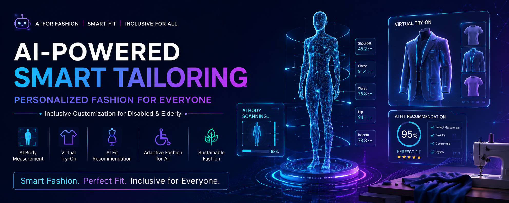

# AIpowered-smart_tailoring
AI-powered smart tailoring system with virtual body measurement, AI-based fit recommendation, adaptive fashion for disabled &amp; elderly people, and sustainable fashion technology.

# 👔 AI-Powered Smart Tailoring
### Personalized Fashion for Everyone
#### Inclusive Customization for Disabled & Elderly

# 🎥 Live Demo   🔗 https://smarttoilering.netlify.app/


<p align="center">
  
</p>

<p align="center">


</p>

---

# 🌍 Project Overview

AI-Powered Smart Tailoring is a futuristic fashion technology platform that combines:

- Artificial Intelligence
- Computer Vision
- Machine Learning
- Virtual Try-On Technology
- Smart Tailoring Automation

to create a next-generation personalized tailoring experience.

This system helps users:
✅ Get accurate body measurements using AI  
✅ Try outfits virtually before stitching or purchase  
✅ Receive AI-based fashion recommendations  
✅ Access adaptive clothing solutions for disabled & elderly people  
✅ Reduce fashion waste through sustainable smart tailoring  

---

# 🚀 Problem Statement

Traditional tailoring and fashion industries face several major challenges:

❌ Inaccurate manual measurements  
❌ Poor fitting clothes  
❌ High product return rates  
❌ Lack of customization for disabled & elderly users  
❌ Time-consuming tailoring process  
❌ Excess textile and fabric waste  

Our AI-powered solution addresses these issues using modern AI technologies.

---

# ✨ Core Features

# 📏 AI Body Measurement Scanner
- Real-time body measurement using smartphone/web camera
- AI-powered pose estimation
- 3D body analysis
- Accurate fit prediction

### Technologies Used:
- MediaPipe
- OpenPose
- PoseNet
- OpenCV

---

# 👕 Virtual Try-On with AI + AR
- AI overlays outfits on the user's body
- Realistic virtual fitting experience
- Augmented Reality fashion preview
- Reduces wrong-size purchases

### Technologies Used:
- GANs (Generative Adversarial Networks)
- DeepFashion
- TensorFlow.js
- OpenCV

---

# 🤖 AI Fit Recommendation System
- Machine learning-based outfit recommendations
- Personalized styling suggestions
- Fashion trend analysis
- Body type prediction

### Technologies Used:
- Neural Networks
- Random Forest Regression
- Deep Learning Models

---

# 🎨 AI Fabric & Design Recommendation
- Smart fabric selection based on:
  - Climate
  - Comfort
  - Skin sensitivity
  - User preferences

- Personalized:
  - Color suggestions
  - Pattern matching
  - Design optimization

---

# ♿ Adaptive Clothing for Disabled & Elderly
This project focuses strongly on accessibility and inclusive fashion.

### Features:
✅ Magnetic closures  
✅ Easy-access openings  
✅ Soft sensory-friendly fabrics  
✅ Wheelchair-friendly designs  
✅ AI-based mobility analysis  

The goal is to make fashion:
- Comfortable
- Accessible
- Independent
- Inclusive for everyone

---

# 🌱 Sustainable AI Fashion
AI helps reduce fashion waste by:

✅ Optimizing fabric cutting  
✅ Predicting fashion trends  
✅ Preventing overproduction  
✅ Supporting sustainable materials  
✅ Reducing product returns  

This creates a smarter and eco-friendly fashion ecosystem.

---

# 🧠 AI Algorithms Used

| Algorithm | Purpose |
|---|---|
| MediaPipe Pose | Body landmark detection |
| OpenPose | Pose estimation |
| PoseNet | Real-time body tracking |
| GANs | Virtual try-on generation |
| CNN | Image processing |
| TensorFlow.js | AI model execution |
| OpenCV | Computer vision |
| Machine Learning | Recommendation systems |

---

# 🏗️ System Architecture

```bash
User Camera Input
        ↓
Pose Estimation (MediaPipe/OpenPose)
        ↓
Body Landmark Detection
        ↓
AI Measurement Processing
        ↓
Virtual Try-On + Fit Recommendation
        ↓
Personalized Tailoring Output
```

---

# 💻 Technology Stack

## Frontend
- React.js
- Tailwind CSS
- Framer Motion

## Backend
- Node.js
- Express.js

## AI / ML
- TensorFlow.js
- OpenCV
- MediaPipe
- OpenPose

## Database
- Firebase / MongoDB

---

# 📸 Project Screenshots

## 🏠 Homepage
(Add Screenshot)

## 📏 AI Measurement System
(Add Screenshot)

## 👕 Virtual Try-On
(Add Screenshot)

## 🤖 AI Recommendation System
(Add Screenshot)

---

# 🎥 Live Demo

## AI Measurement Demo
🔗 https://kzmj9nveuc4j6ytq0x2f.lite.vusercontent.net/measurement

---

# 🔮 Future Scope

🚀 AI Tailoring Robots  
🚀 Gesture-Based Measurement  
🚀 Smart IoT Clothing  
🚀 AI Fashion Assistants  
🚀 Blockchain Fashion Authentication  
🚀 Fully Automated Tailoring Factories  

---

# 🌍 Industry Impact

This project aims to revolutionize the fashion industry by:

✅ Improving tailoring precision  
✅ Enhancing accessibility  
✅ Supporting sustainable fashion  
✅ Reducing textile waste  
✅ Creating inclusive clothing experiences  

---

# 📂 Project Structure

```bash
ai-powered-smart-tailoring/
│
├── frontend/
├── backend/
├── assets/
├── docs/
├── demo/
├── README.md
└── LICENSE
```

---

# 📚 Research & Inspiration

Inspired by modern AI fashion technologies including:

- Google MediaPipe
- TensorFlow
- OpenCV
- DeepFashion
- AI-based Virtual Try-On Systems

---

# 👨‍💻 Author

## Sudharshan

AI & Computer Vision Enthusiast  
Focused on building intelligent real-world solutions using:
- Artificial Intelligence
- Machine Learning
- Computer Vision
- Modern Web Technologies

---

# 🤝 Contributions

Contributions, ideas, and improvements are welcome.

Feel free to fork the repository and contribute.

---

# ⭐ Support

If you found this project interesting:

⭐ Star this repository  
🍴 Fork this repository  
📢 Share with others  

---

# 📜 License

This project is licensed under the MIT License.

---

# 🚀 Final Vision

> “AI is transforming fashion into a smarter, more inclusive, and sustainable future.”

